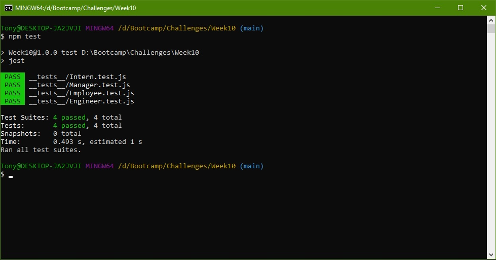

# Team Profile Generator
The purpose of this challenge is to create a CLI that accepts user inputs for employees and then outputs it into an HTML file with role specific formatting.

## Table of Contents
* [Criteria](#criteria)
* [Tools used](#tools-used)
* [Contributions](#contributons)
* [Final Result](#final-result)

### Criteria
* Command-line interface (CLI) application
* Prompts user for team member/employee information
    * Prompts for team manager information
        * Name
        * Employee ID
        * Email address
        * Phone number
    * Presented with menu to add engineer or intern
        * Engineer options
            * Name
            * Employee ID
            * Email
            * Github username
        * Intern options
            * Name
            * ID
            * Email
            * School
        * After entering information for one, proceed back to menu to ask if additional employee/intern to add
* Creates an HTML file after all information provided
    * Formatted to display each role and name uniquely
* Each employee entered has the following
    * Email address that links to default email program
    * Github username that links to Github profile
* Must use Jest and Inquirer to run application

### Tools Used
* Node.js
* Jest
* Inquirer

## Contributions
Designed and written by Tony Huang

## Final Result
### CLI Application Prompt

### Sample passed Jest tests

### Sample output HTML File

### Video of Application Running
<a href='' target="_blank">Application test video</a>